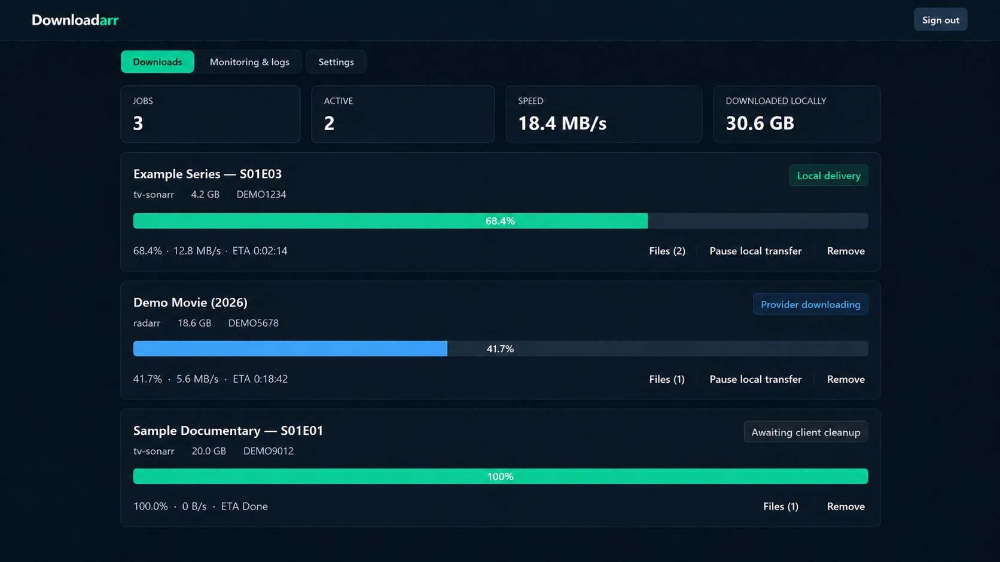
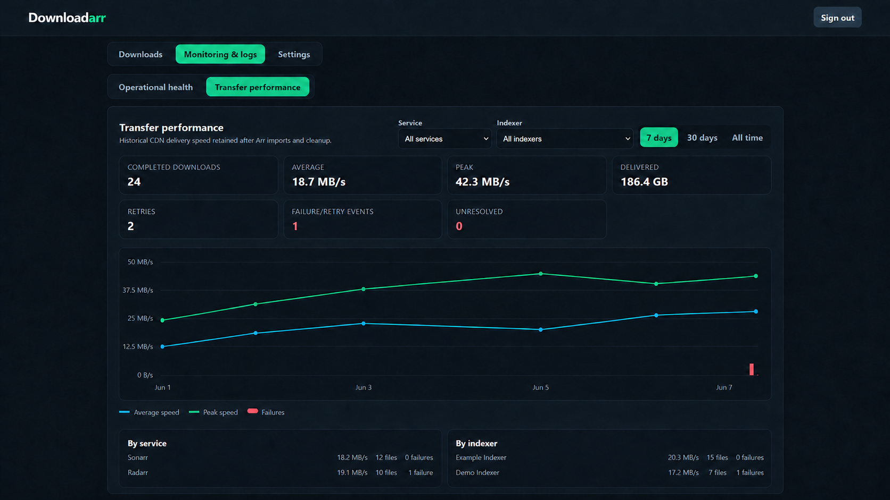

# Downloadarr

Downloadarr is a self-hosted TorBox download client for Sonarr and Radarr. It
implements the qBittorrent Web API surface those applications need, persists
jobs in SQLite, downloads ready files with safe resume support, and provides an
authenticated monitoring dashboard.

> **Alpha:** Downloadarr has automated tests and has completed live Sonarr and
> Radarr import cycles, but it is not yet a stable release. Run one application
> process, keep backups, and test with replaceable data first.

## Interface preview

### Downloads



*Active downloads shown with sanitized demo data.*

### Transfer performance



*Transfer performance dashboard shown with sanitized demo data.*

## Features

- qBittorrent-compatible authentication, submission, polling, categories,
  pause/resume, and deletion for Sonarr and Radarr;
- TorBox magnet and `.torrent` submission with durable local job state;
- resumable HTTP delivery, integrity checks, bounded retries, and conservative
  handling of existing files;
- extension allowlisting and an unconditional executable/script denylist;
- lifecycle, transfer, failure, and operational monitoring;
- atomic settings writes, backups, health checks, and maintenance commands.

## Supported platform

The supported deployment is a Linux host running Docker Engine with the Docker
Compose plugin. Windows and Docker Desktop have not been validated and are not
currently supported. SQLite must use local Linux storage; NFS, SMB/CIFS, and
FUSE filesystems are unsupported for `/config`.

## Install with Docker Compose

You need Docker Engine, Docker Compose, a TorBox API token, and a host directory
that Sonarr, Radarr, and Downloadarr can all mount as `/downloads`.

### 1. Prepare the project

```bash
git clone https://github.com/raespanha/downloadarr.git
cd downloadarr
cp .env.example .env
mkdir -p config
cp settings.example.json config/settings.json
docker network inspect downloadarr >/dev/null 2>&1 || docker network create downloadarr
```

### 2. Configure `.env`

Open `.env` and replace every value containing `replace-with`. At minimum, set:

- `DOWNLOADARR_PASSWORD` to a unique password of at least 12 characters;
- `TORBOX_API_TOKEN` to your TorBox token;
- `DOWNLOADARR_MEDIA_PATH` to the shared host download directory;
- the optional Sonarr and Radarr API keys to enable metadata enrichment.

The tracked `settings.example.json` deliberately contains invalid placeholder
secrets. Values from `.env` override them, so real credentials do not need to
be written to JSON. Never commit `.env` or the `config` directory.

The container runs with UID/GID `1000:1000` by default. Set `DOWNLOADARR_UID`
and `DOWNLOADARR_GID` to the numeric account that owns the shared directory,
then ensure that account can write to both the configured host media path and
`./config`.

### 3. Start Downloadarr

```bash
docker compose up -d --build
docker compose ps
docker compose logs --tail=100 downloadarr
```

The service is ready when `docker compose ps` reports `healthy`. The dashboard
is available at `http://127.0.0.1:6500/`; sign in with `DOWNLOADARR_USERNAME`
and `DOWNLOADARR_PASSWORD`.

The default localhost binding is intentionally not reachable from another
machine. Set `DOWNLOADARR_BIND` to a trusted LAN address only when needed, and
never expose port 6500 directly to the Internet.

### 4. Share the Docker network and download path

Add the existing Downloadarr network and the same container path to the Compose
configuration used by Sonarr and Radarr. The relevant fragment for each service
is:

```yaml
services:
  sonarr: # use radarr for the Radarr service
    volumes:
      - /srv/media/downloads:/downloads
    networks:
      - downloadarr

networks:
  downloadarr:
    external: true
    name: downloadarr
```

Replace `/srv/media/downloads` with the exact value of
`DOWNLOADARR_MEDIA_PATH`, then recreate the Arr containers. Their existing
networks and volumes should remain in place. All three containers must resolve
one another on the `downloadarr` network and see identical `/downloads` paths.
No Arr Remote Path Mapping is needed when the container paths match.

### 5. Add Downloadarr to Sonarr and Radarr

In **Settings → Download Clients**, add a qBittorrent client with these values:

| Field | Sonarr | Radarr |
| --- | --- | --- |
| Name | Downloadarr | Downloadarr |
| Host | `downloadarr` | `downloadarr` |
| Port | `6500` | `6500` |
| Use SSL | No | No |
| Username | `DOWNLOADARR_USERNAME` | `DOWNLOADARR_USERNAME` |
| Password | `DOWNLOADARR_PASSWORD` | `DOWNLOADARR_PASSWORD` |
| Category | `tv-sonarr` | `radarr` |
| Remove completed | Yes | Yes |

Use each application's **Test** button before saving. Then submit one small,
legal, replaceable download and verify that it reaches `/downloads`, imports
into the library, and disappears from Downloadarr after Arr cleanup.

## Configuration and operations

The default configuration is `/config/settings.json`. Environment variables
override JSON fields, and secret `_FILE` variants are supported for the
qBittorrent password/API key, TorBox token, and Sonarr/Radarr API keys.

- [Settings reference](docs/settings.md)
- [Container deployment details](docs/deployment.md)
- [Production runbook](docs/production-runbook.md)
- [Roadmap](docs/roadmap.md)

To stop or update the installation:

```bash
docker compose down
git pull --ff-only
docker compose up -d --build
```

Back up `config/settings.json` and `config/downloadarr.db` using the maintenance
commands in the production runbook. Do not copy a live SQLite database file or
delete its `-wal`/`-shm` files while Downloadarr is running.

## Development

Development and tests are supported on Linux with Python 3.12 or 3.13.
Dependencies are hash-locked.

```bash
python -m venv .venv
. .venv/bin/activate
python -m pip install --require-hashes -r requirements-test.lock
PYTHONPATH=src python -m pytest -q
```

## Important limitations

- One process/worker only; multi-worker and replica scheduling are unsupported.
- Docker inside an unprivileged LXC is not a supported deployment target.
- A dashboard pause may be local-only when the provider cannot be paused.
- Downloadarr is not affiliated with TorBox, Sonarr, Radarr, or qBittorrent.

Use only content you are legally entitled to download. See
[SECURITY.md](SECURITY.md) for responsible disclosure and deployment guidance.

## License

[MIT](LICENSE)
